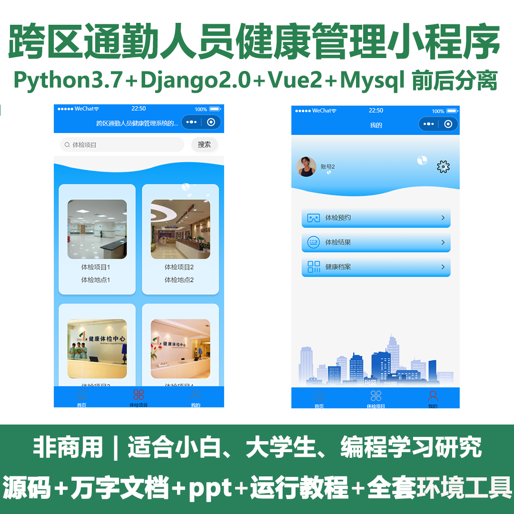
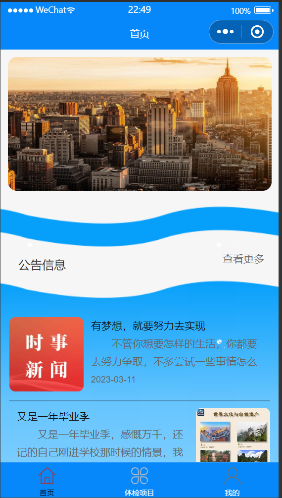
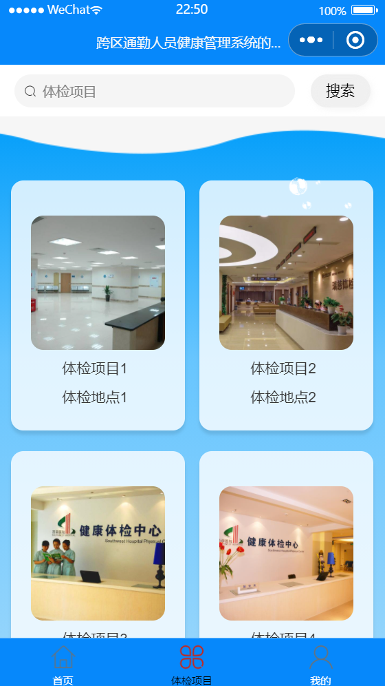
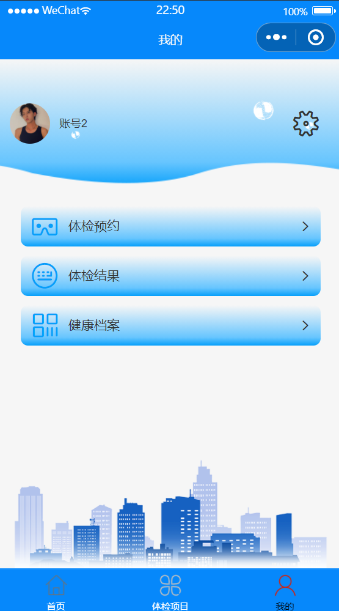
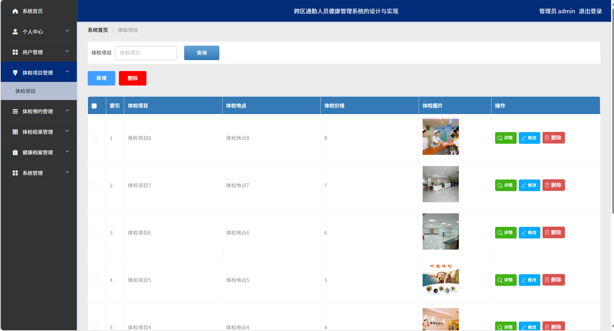
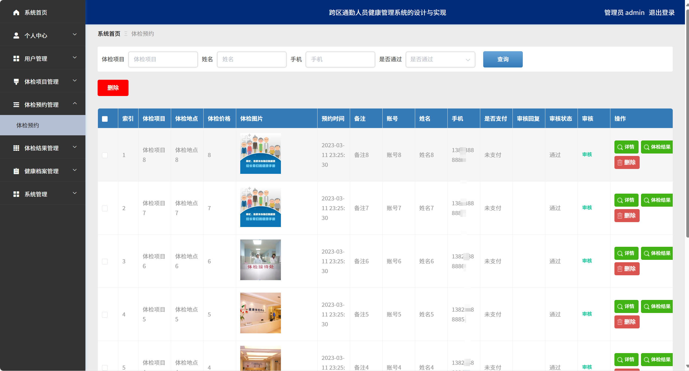
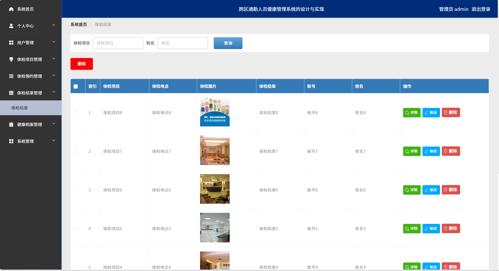
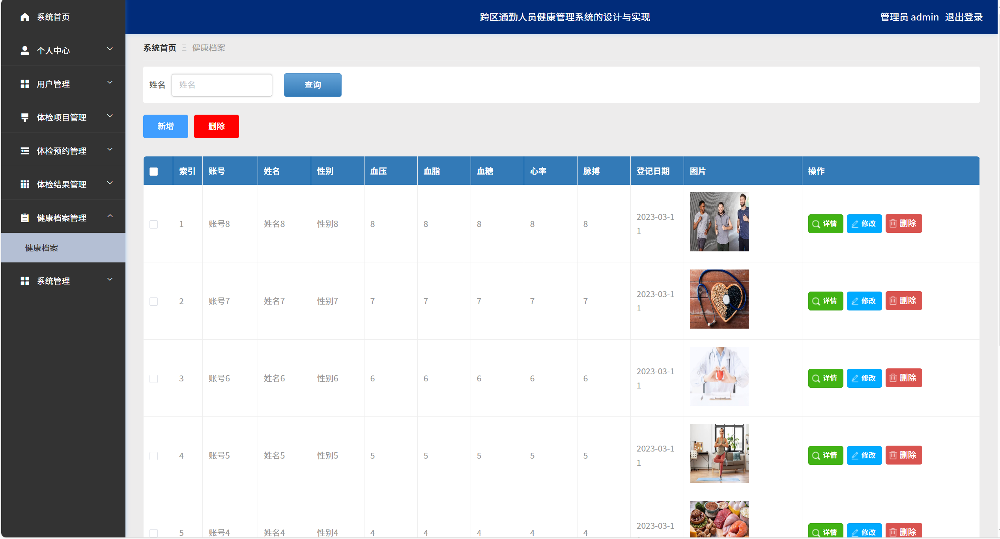
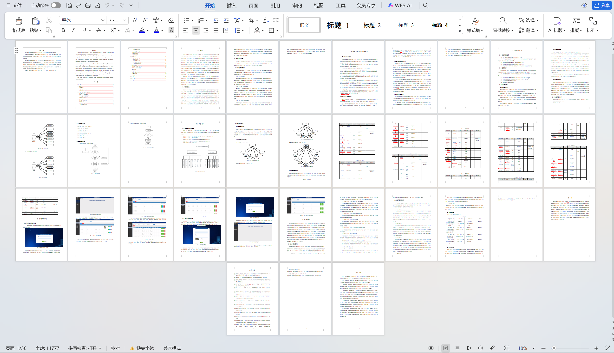

# mpweixinA084
mpweixinA084跨区通勤人员健康管理小程序+LW+PPT
 
## 查看主页获取源码

### 一、关键词
跨区出行健康管理，跨区通勤健康助手，通勤健康通小程序

### 二、作品包含
源码+数据库+万字设计文档+PPT+全套环境和工具资源+本地部署教程

### 三、项目技术
前端技术：Html、Css、Js、Vue2.0、Element-ui、uniapp
后端技术：Python3.7、Django2.0

### 四、运行环境（以下版本亲测，其他版本兼容性请自行测试）
开发工具：PyCharm + VSCODE + 微信开发者工具 + HBuilder X

数据库：MySQL5.7（最低要5.7版本）

数据库管理工具：Navicat10+

Python：Python3.7

前端Nodejs：14

浏览器：谷歌浏览器

### 五、项目介绍
项目编号：mpweixinA084

跨区通勤人员健康管理系统设计的目的是为用户提供体检项目等功能。
与其它应用程序相比，跨区通勤人员健康的设计主要面向于跨区通勤人员，旨在为管理员和用户提供一个跨区通勤人员健康管理系统。用户可以通过系统及时查看体检预约等。
跨区通勤人员健康管理系统是在Windows操作系统下的应用平台。为防止出现兼容性及稳定性问题，服务器选择的是django，前台与后台之间的数据存储主要通过MySQL。用户在使用应用时产生的数据通过 Python等语言传递给数据库。通过此方式促进跨区通勤人员健康管理系统信息流动和数据传输效率，提供一个内容丰富、功能多样、易于操作的跨区通勤人员健康管理系统。

### 六、运行截图

